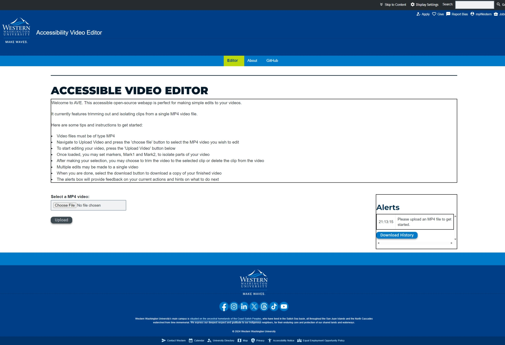
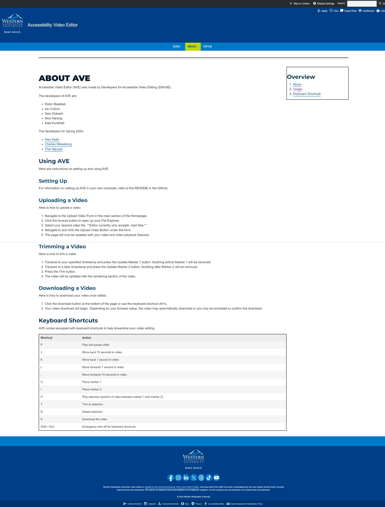
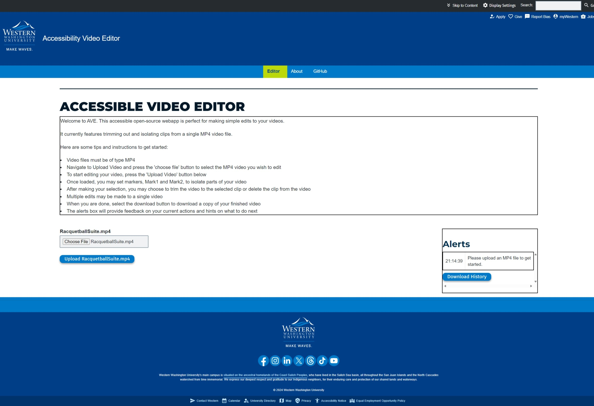
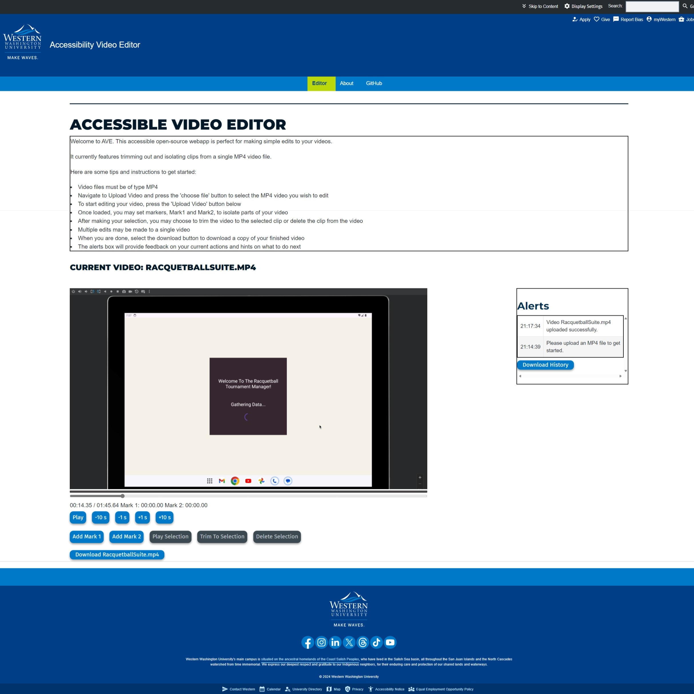

# Accessible Video Editor
## Jump to
* [Project Info](#project-info "Goto project-info")
* [R1 Contributions](#r1-contributions "Goto r1-contributions")
* [Installation Info](#installation-info "Goto installation-info")
* [UI Documentation](#ui-documentation "Goto ui-documentation")

## Project Info
This project is ongoing from previous quarters. As a result our github classroom space is not the repository where our work is done, but rather where we are uploading snapshots for each assignment requirement. If you would like to navigate to the main repository [click here](https://github.com/wwu-webtech/ave "goto github.com/wwu-webtech/ave").
### Course and Team
#### Course
CSCI 497T with Professor Elglaly

#### Team Members Spring 2024
- Thai Nguyen
- Alex Kefer
- Charles Mikkelborg

#### Previous Team Members
- Robin Balatbat
- Ian Cullum
- Sam Dobesh
- Nick Harang
- Kale Kurtzhall

## Features
### New Additions
#### Styling
One of the largest feature changes for this project was to polish the look and feel of the app by incorporating Ashlar components and theme into the application so that it is in line with the look and feel of a Western webpage. This redesign is one of our primary requirements in order to bring it to a deployable state. The Ashlar components also feature a pre-header section that handles theme and font setting preferences that make the original app's accessibility section redundant and so they have been removed. Keyboard shortcuts are now always on by default in lieu of their section's removal.
#### Navigation
Navigation has been redesigned so it is consistent across all pages and all pages share the same theme, Western's website theme, as to comply with WCAG 2.1 criterion 3.2.3 and guideline 3.2 in general. The timeline and mark info display has also been adjusted to allow for tabbing between the different items instead of all items being treated as a single element. This adds additional accessibility support for those navigating by keyboard.
#### Alerts
The Alerts window originally appeared above and to the right of a shortcuts menu which has since been removed and displayed the most recent alert to the client. This area was positioned at the top of the screen above the player. It now appears to the right of the select file or player window depending on their journey through the app. It also now features the entire history of alerts via a tabled entry and grows until it is equal in height to the player where it will then turn into a scrollable section. Each entry now includes the time, in the format of hours, minutes, and seconds, at which the alert was first displayed so that the client now has a history of their alerts and actions to reference back on. It also now has the added benefit of being downloadable through the download History Button.
### Previous Work
#### Upload Video
When selecting the "Choose File" button a open file dialog is brought up where the client can search and select a valid MP4 file (only MP4s are valid at this time). Once a file is selected the page will reflect the selection by displaying the file name above the "Choose File" button. At this point the file may be uploaded into the web app by selecting the "Upload \<filename\>" button.
#### Movie Player
Upon successful upload of the file the movie player and editor are loaded for the client to begin their work. The player has the video file name printed above the player for clarity and is followed by the player window where the client may play and seek through the video and to the right of the player window is the alerts window that displays instructions and client actions along with the timestamp of when they were first displayed. Below the player window is the player time information, which is read as "current time / total video time" where the time is displayed in the format minutes, seconds, and milliseconds. Beside that are the time positions of Mark 1 and Mark 2 within the video. The player buttons include "Play" (or "Pause"), "-10s", "-1s", "+1s", and "+10s". These buttons allow for easy navigation of the video by providing large a play/pause button as well as seek tools to move forward or back in 1 and 10 second increments.
#### Editor Tools
The editing tools consists of six buttons. "Add Mark 1" and "Add Mark 2" are for selecting portions of the video that the client would like to take action on. The selected portion of the video is the portion that lies between Mark 1 and Mark 2. Once a portion of the video has been selected by marking its boundaries, the client may select "Play Selection" to only play the selected portion, "Trim To Selection" to remove out everything but the selected portion, and "Delete Selection" to remove out only the selected portion. After all editing is complete the client may choose "Download \<filename\>" to retrieve a copy of their edited video.

## R1 Contributions
- Thai Nguyen
    - Styling
        - Incorporated Ashlar components and theme into the application to make it look and feel more like a Western page.
        - The Ashlar pre-header now handles the theme change and font change.
    - Timeline
        - Adjusted timeline to be more spaced out and distinct from the progress bar.
        - Added accessible labels to the current time, marker 1, and marker 2 text and made them tabbable.
    - Navigation
        - Reformatted the navigation to be consistent across all pages to comply with WCAG 2.1 criterion 3.2.3
- Alex Kefer
    - Alerts
        - Designed and organized the alert box to be easily accessible by both visually impaired and non-visually impaired users.
        - Formatted the input data into a table in order for easy parsability for screen reader users.
    - Homepage Layout
        - Re-organized the homepage sections in order for a more seamless user interaction.
        - Removed styling options that conflicted and are covered by the Ashlar template.
    -  Keybindings
        - Fixed broken keybindings by properly installing the correct dependencies and modifying the code to support the changes of the dependencies.
        - Modified keybindings to be similar to other video or audio editing applications. 
- Charles Mikkelborg
    - Alerts
        - Added Timestamps to alert messages that display HH:MM:SS that an alert was posted.
        - A bulleted history of alerts displays instead of only a single alert message at a time. This list grows as more messages are added.
        - The session's alert history may now also be downloaded using the download history button, which downloads a text file with each message on it's own line.
    - Introduction
        - An introduction has now been added that provides helpful instructions to navigate and use the app.
    - Put together UI documentation

## R2 Contributions
- Thai Nguyen
    - Alerts
        - Added additional backend features to notify which marker is places and what the time associated is.
        - Moved the download history button to be fixed to the bottom of the alerts section
    - Feedback
        - Included a loading dialog for when the trim, delete, and download form is submitted. This gives visual feedback to the user that the backend is currently processing the request.
- Alex Kefer
    - Alerts
        - Removed useless horizontal slider on alert box.
        - Added row and column scopes to the Alertbox
        - Styled the text and buttons in the Alertbox to not be touching the edges of the box
    - Introduction
        - Styled text in Introduction to not interfere with border box
- Charles Mikkelborg
    - Debug
        - Debug mode within the start script was not working as intended. It was using an depracted feature from several years ago. This has been updated to use the current syntax.
    - Alerts
        - Fixed download to write new parsed table data, instead of original string data
    - Requirements
        - As moviepy is no longer up to date and the current build is breaking with most builds, I have researched and created a list of packages and set package versions to make biulds consistent for every user or developer. This way future devs and users have a consistent experience and work environment


## Installation Info
### Dependencies
Requires Python 3 and Flask.

Install flask and Flask-Reuploaded with pip (or conda) in a virtual environment.
Note that for Conda, you will have to install pip to the Conda environment, and then call pip from the environments bin folder. The path to the folder `anaconda` may be different on your system, but it installs to your home directory by default.

#### Linux

##### Pip
```
python3 -m venv env
source env/bin/activate
pip install -r requirements.txt
```

##### Conda
```
conda create --name env
conda activate env
conda install pip
~/anaconda/envs/env/bin/pip install -r requirements.txt
```

#### Windows PowerShell
```
py -3 -m venv venv
venv\Scripts\activate
pip install -r requirements.txt
```

### Quick Start
The following scripts will run AVE locally on your computer in debug mode.

#### Bash Script
```
./run
```

#### CMD Script
```
./run.cmd
```

#### PowerShell Script
```
./run.ps1
```

### Live Test
This runs the app on port 8080 for external access. Intended for testing with remote participants

#### Bash Script
```
./run_live
```

#### CMD Script
```
./run_live.cmd
```

#### PowerShell Script
```
./run_live.ps1
```

### Clean
This script exists to clear out the upload folder.
```
./clean
```

#### Manually
Run each code line from the script associated with your terminal.
If your terminal scripting language is not supported you can do the following.
Create two environment variables, `FLASK_DEBUG` and `FLASK_APP`.
Set `FLASK_DEBUG` to `1` and `FLASK_APP` to `main`. 
Then start the website locally with `flask run`.

## Current Issues
### Video Editing
#### moviepy
One of the biggest outstanding issues is that of the status of the moviepy package. moviepy has not seen any releases for over 2 years while many of its dependancies have updated regularly during that time. The result is that many of its features are broken. Misleadingly this has not led to outright errors but rather that the intended actions are just not executed. One example is that of the debug mode within the starting script - the original `FLASK_ENV` was replaced by `FLASK_DEBUG` but newer environments would not show any errors despite being deprecated over a year ago and that code now has no functionality. Having no warnings or errors has hurt development with the current team as there was no indication that code was not being executed as expected. Having this experience we recommend the following: either future developement find a alternative package to moviepy to edit mp4 videos or wait for future developement of moviepy, which as of 6/2024 has seen recent developement, though no official release.

That being said, we think it is important that future developement would benefit from having the same dev environment. We have included a requirements.txt that includes package versions that we feel will produce the best working environment. Note that if moviepy where to be updated these requirements would be obsolete.

The following functionality seem to be broken with most environments (it is currently unknown if trim and delete are broken or just the downloaded result):
- trim to selection
- delete selection
- download video (downloaded video is reliably a single frame with the expected audio)

## UI Documentation
### Landing
ID: ave_landing

The landing page of the Ave webapp is the starting point for each user. It features an introduction section before the user interactable interface that provides brief instructions, tips, and accessibility features overview to orient users, especially those with visual impairments, before they begin editing in accordance with WCAG criterion 3.3.2. This page's purpose is to facilitate the uploading of the MP4 video to be edited in later screens (see [ave_upload](#upload) and [ave_editor](#editor)). We have redesigned the app to conform to Western's page design guidelines by using the Ashlar component toolset as to create a page that has the look and feel of Western's website. This is important because Western's website is the planned place for deploying this app and to comply with WCAG 3.2 and specifically criterion 3.2.3 it was important to make sure the pages appear and operate in predictable ways and that Navigational mechanisms that are repeated on multiple web pages with in a set of web pages occur in the same relative order each time they are repeated, as well as WCAG criterion 3.2.4 which state components that have the same functionality within a set of web pages are identified consistently. The page also contains an Alert section to give further queues and context to what the user has done or needs to do next. The interactable section directs the user to select a MP4 video by selecting the "Choose File" button which will bring up a file selection dialog box where the user may search and select the video they wish to edit from their filesystem. Once selected the file may be uploaded to the editor by pressing the "Upload" button. This is the primary feature and function of the Landing page. No simulated backend is needed for the Landing as we have a functioning flask server to handle requests and therefore is fully functional.

### About
ID: ave_about

The purpose of the about page of the Ave webapp is to provide a space the user may go for additional information about the editor and its use. It features a more detailed guide of the functionality of editing tools and features a overview section with skip links that allow for easy navigation as to have greater compliance with WCAG 2.4 and a section about keyboard shortcuts to alert the user that they exists and a detailed explanation of all shortcuts within the editor. It is also important for our Ave to be compliant with criterion 2.1.1 which states that all functionality should be operable through a keyboard interface. The page itself has been redesigned to conform to Western's page design guidelines by using the Ashlar component toolset as to create a page that has the look and feel of Western's website to comply with WCAG 3.2 and specifically criterion 3.2.3, as well as WCAG criterion 3.2.4 which state components that have the same functionality within a set of web pages are identified consistently. By using Ashlar components, we are also complying with a host of WCAG criterion such as 1.4 with use of color and contrast, 2.1 with added keyboard functionality. No simulated backend is needed for the Landing as we have a functioning flask server to handle requests and therefore is fully functional.

### Upload
ID: ave_upload<br />

The system feature that this screenshot represents is the Upload Video feature. 
The input field has a form label associated with it complying with WCAG success criteria 2.4.6. The upload button is initially disabled and will remain so if there is no file inputted. After a file is inputted, the upload button will be able to be interacted with and when clicked will trigger the upload process. The button complies with WCAG success criteria 2.5.3 and conform for the color contrast ratio of 4.5 to 1.

### Editor
ID: ave_editor<br />

The system feature that this screenshot represents is the Editor Tools, Alerts, and Movie Player feature. 
We designed the editor to be keyboard accessible which means the entire interface can be navigated and interacted with using only the keyboard.
The interface is also screen reader accessible which makes it usable for people who are blind or visual impaired. The UI uses simple and clear language that is easy to understand.
It also uses a high contrast color scheme and easy of read fonts that can be customized to fit the user's needs. The alerts box to the right of the screen keeps track of user and system actions and has a time attached to each action to provide an accurate timeline of user activity. This log can be downloaded as well. 
Within the editor tools, the user has access to 5 rows of controls and information. The first being an input field that dictates the current position of the video. The input field has aria labels attached to it make it accessible to screen readers complying with WCAG success criteria 3.3.2. The second row has tabbable information such as the current of the input field in comparison to the full length of the video, marker 1's position, and marker 2's position. Row 3 has the aria label of 'Play Head' as it is contains the controls for the video player. From left of right, the buttons are Play, rewind 10 seconds, rewind 1 second, forward 1 second, and forward 10 second. All these controls comply with WCAG success criteria 2.5.3. The fourth row contains buttons that facilitate editing the video. There are 5 buttons in this row with 3 being initially disabled to prevent errors. The first two buttons allow the user to place markers 1 and 2 which are times in the video that the users wants to edit. Above marker 1 and 2 being placed, the remaining 3 buttons will then be usable. The 'Play Selection' button will play the video from marker 1 to marker 2, the 'Trim to Selection' button will remove any parts of the video not with the times of marker 1 and 2. The last button 'Delete Selection' will remove any parts of the video within the times of marker 1 and 2. The last row only has one button that will download the editted video to the user's downloads folder. Like in row 3, all the buttons in row 4 and 5 comply with WCAG success criteria 2.5.3 and each row has aria labels associated it them. The alerts contains a table that contained the time an action occurred and the action itself.
